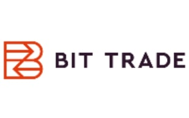
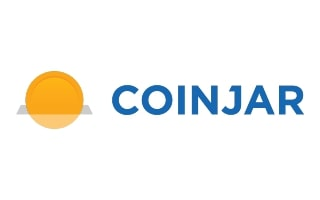

# Coinspot CaseStudy

 

## Coinspot Overview
Coinspot was incorporated in 2013 by Russell Wilson, with cryptpcurrencies rapidly gaining popularity in Australia and globally. The company seeked to provied an easily accessible way for the average person to:
1. Access to a wide range of cryptoassets and trade them easily.
1. Store securely.
1. Educate themselves on this new concept/industry.
1. Have a platform with a solid reputation they know when utilising they would be compliant with regulatoty authorities.

## Business Activites

- CoinSpot has revolutionised the digital currency market by providing a secure platform which aims to break down the technical barriers enabling a greater range of Australians to experience digital currencies.
- CoinSpot promotes a strong digital currency community with an aim to expand and broaden the acceptance of blockchain assets in an aim to gain greater acceptance in Australia.
- CoinSpot provides customers with the largest selection of blockchain assets of any Australian Exchange with easy purchase options and an easy way to store coins for active trading.
- CoinSpot introduces a wide range of Australians, both beginners and experienced, to digital currencies by providing an easy to use platform that allows anyone to gain entry into the blockchain market.

## Landscape

Coinspot operates exclusively in the cryptocurrecy trading space, the company has grown to be the number 1 trading platform for australian crypto-asset investors/traders. 
- It's designed to be easy, accessible and user-friendly for both beginners and experienced cryptocurrency enthusiasts. In September of 2021 CoinSpot hit 2 million users, [Doubling its user base in just 6 months](https://www.businessinsider.com.au/coinspot-users-dogecoin-crypto-australia) 
- Supports Approximately **308 cryptocurrencies**
### Payment methods accepted
- Bank Transfer
- BPAY
- Cash
- POLi
- PayID

>CoinSpot also holds certifications under ISO27001 Standards for Information Security and Blockchain Australia's code of conduct demonstrating their commitment to security and customer support.

Bit Trade Pty Ltd. is the top competitor of Coinspot. Bit Trade Pty Ltd. is a Private company that was founded in Sydney, New South Wales in 2013. Bit Trade Pty Ltd. operates in the Internet Software industry. Bit Trade Pty Ltd. has 10 more employees vs. Coinspot.

CoinJar is seen as one of Coinspot's biggest rivals. CoinJar was founded in London, England} in 2013. CoinJar is in the Internet Software field. Compared to Coinspot, CoinJar generates $452.2K more revenue.

Cointree is perceived as one of Coinspot's biggest rivals. Cointree was founded in 2013, and is headquartered in Docklands, Victoria. Like Coinspot, Cointree also operates in the Transaction Services sector. Cointree generates $700K less revenue vs. Coinspot.

>Coinspot still reigns supreme in its domain of cryptocurrency due to its trusted reputation, user-friendly interface, huge selection of digital assets and ease/ range of payment methods.

## Recommmendations

- In my opinion the company has excelled in creating a great trading environment for traders and investors. A leap forward in their innnovation and a push forward in the direction of cryptocurrencies being mainstream would be implementation of a **CoinSpot Debit Card**, which CoinJar already has available to their users. CoinJar partnered with Mastercard and integrated with Apple Pay and Google Pay to allow their users to spend their cryptoassets like they would any other currency. For example CoinJar's Debit Card *Is free to activate, has no monthly fee's and the usual 1% transaction fee's are returned to users in the form of an in-house loyalty program*. 

[CoinJar launches crypto-to-fiat Mastercard card in Australia](https://www.finextra.com/pressarticle/88826/coinjar-launches-crypto-to-fiat-mastercard-card-in-australia)

EML Payments (ASX: EML) (S&P/ASX 200) and CoinJar, Australia’s longest-running cryptocurrency exchange, are taking crypto into the mainstream with CoinJar Card. The collaboration will make it simple for cardholders to pay using cryptocurrency via a digital or physical card wherever Mastercard is accepted.CoinJar has already helped users conduct billions of dollars' worth of transactions in Bitcoin, Ethereum and other cryptocurrencies. CoinJar Card gives those users a simple, secure and seamless way to bring their crypto into the real world, one purchase at a time. With more than 500,000 customers in Australia and the U.K., CoinJar has already helped users conduct billions of dollars' worth of transactions in Bitcoin, Ethereum and other cryptocurrencies. CoinJar Card gives those users a simple, secure and seamless way to bring their crypto into the real world, one purchase at a time.[1]

1. https://www.finextra.com/pressarticle/88826/coinjar-launches-crypto-to-fiat-mastercard-card-in-australia

